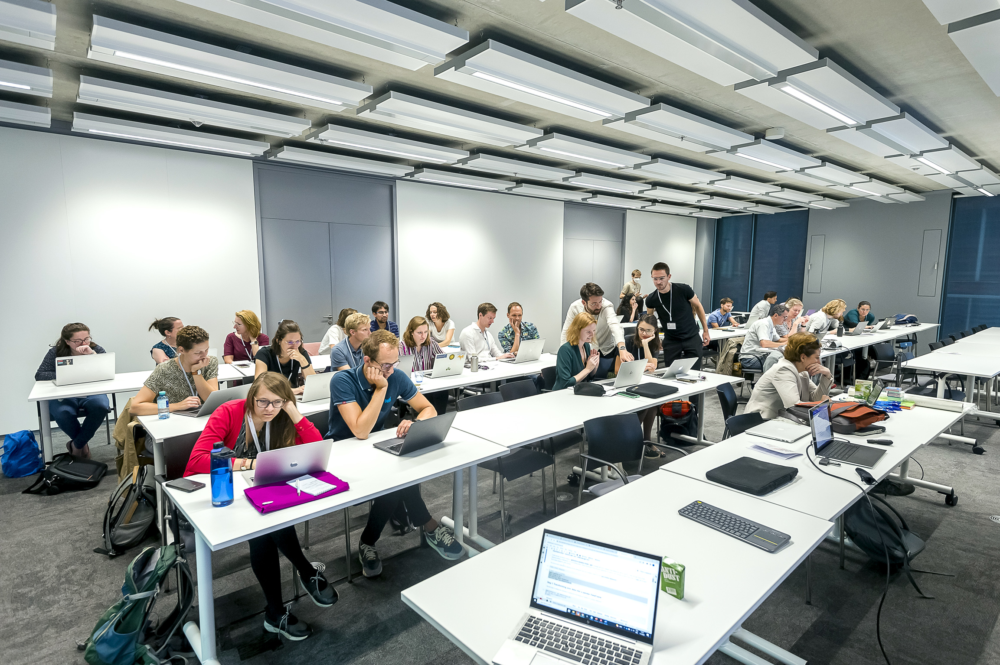

# OSF2022 synthetic data workshop
Archive for the synthetic data pre-conference workshop at the [Open Science Festival](https://opensciencefestival.nl) on September 1, 2022.

 

_photo by Pim Rusch (c)_

# Contents of this archive
The original workshop proposal submitted to the conference can be found in the [`00_proposal`](./00_proposal/) folder.

The workshop was held in four parts:

- [`01_introduction`](./01_introduction/) - An introduction to synthetic data & the privacy-utility tradeoff. 
- [`02_metasynth`](./02_metasynth/) - Hands-on high-privacy synthetic data generation using the [metasynth](https://github.com/sodascience/metasynth) package.
- [`03_synthpop`](./03_synthpop/) - Hands-on high-utility synthetic data generation using the [synthpop](https://synthpop.org.uk) package.
- [`04_closing`](./04_closing/) - A short closing / conclusion.

# Abstract
Open data is one of the pillars of open science. However, there are often barriers in the way of making research data openly available, relating to consent, privacy, or organisational boundaries. In such cases, synthetic data is an excellent solution: the real data is kept secret, but a "fake" version of the data is available. The promise of the synthetic dataset is that others can then investigate the data structure, rerun scripts, use the data in educational materials, or even run a completely different analysis on their own.

But how do you generate synthetic data? In this session, we will introduce the field of synthetic data generation and apply several tools to generate synthetic versions of datasets, with various level of utility and privacy. We will be paying extra attention to practical issues such as missing values, data types, and disclosure control. Participants can either use a provided example dataset or they can bring their own data!

# Contact

 

This workshop was a project by the [ODISSEI Social Data Science (SoDa) team](https://odissei-soda.nl).

Do you have questions, suggestions, or remarks on the technical implementation? File an issue in the issue tracker or feel free to contact [Erik-Jan van Kesteren](https://github.com/vankesteren), [Raoul Schram](https://github.com/qubixes), or [Thom Volker](https://github.com/thomvolker).
